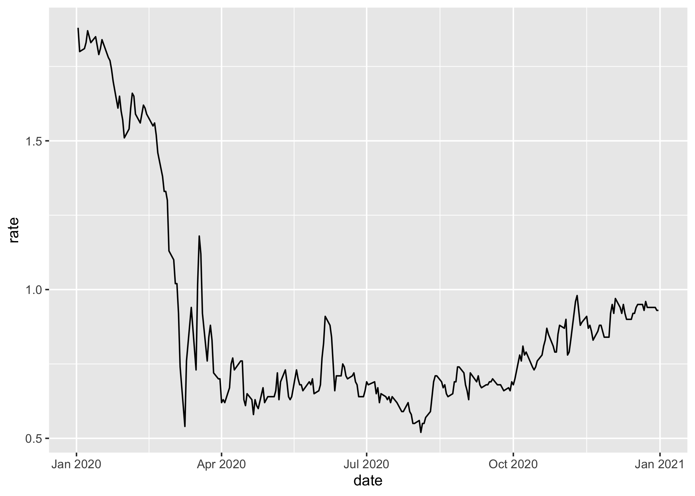

<!-- README.md is generated from README.Rmd. Please edit that file -->

# treasury

<!-- badges: start -->

[](https://lifecycle.r-lib.org/articles/stages.html#experimental)
[](https://github.com/m-muecke/treasury/actions/workflows/R-CMD-check.yaml)
<!-- badges: end -->

## Overview

The goal of treasury is to provide a simple and modern interface to the
[US treasury XML
feed](https://home.treasury.gov/treasury-daily-interest-rate-xml-feed)
for daily interest rates. The main difference to other packages is that
it’s a modern implementation using the [httr2](https://httr2.r-lib.org)
package.

## Installation

You can install the development version of treasury from
[GitHub](https://github.com/) with:

``` r
# install.packages("pak")
pak::pak("m-muecke/treasury")
```

## Usage

treasury functions are prefixed with `tr_` and follow the naming
convention of the XML feed.

``` r
library(ggplot2)
library(treasury)

yield_curve <- tr_yield_curve(2020)
yield_curve
#> # A tibble: 3,012 × 3
#>   date       maturity  rate
#>   <date>     <chr>    <dbl>
#> 1 2020-01-02 1 month   1.53
#> 2 2020-01-02 2 month   1.55
#> 3 2020-01-02 3 month   1.54
#> 4 2020-01-02 6 month   1.57
#> 5 2020-01-02 1 year    1.56
#> # ℹ 3,007 more rows

subset(yield_curve, maturity == "10 year") |>
  ggplot(aes(x = date, y = rate)) +
  geom_line() +
  labs(
    title = "US Treasury Yield Curve 2020 (10 Year Maturity)",
    x = NULL, y = NULL
  ) +
  theme_minimal()
```



## Related work

- [ustyc](https://github.com/mrbcuda/ustyc) - R package to download and
  parse the US Treasury yield curve data
