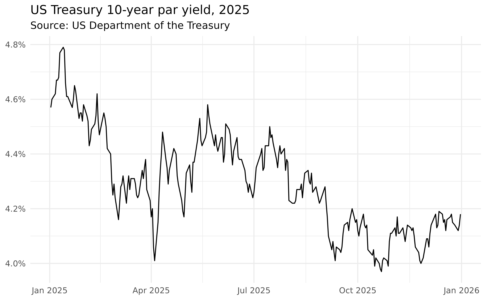

# Getting started with treasury

treasury gives you a simple, modern interface to US Treasury data. It
covers both the [daily interest rate XML
feed](https://home.treasury.gov/treasury-daily-interest-rate-xml-feed)
and the historical [Treasury coupon issues and corporate bond yield
curves](https://home.treasury.gov/data/treasury-coupon-issues-and-corporate-bond-yield-curves).

Every function is prefixed with `tr_`, follows the naming convention of
the upstream feed, and returns a tidy `data.table`.

``` r

library(treasury)
```

## Daily interest rates

The interest rate functions all share the same `date` argument: pass a
year as `yyyy`, a month as `yyyymm`, or leave it `NULL` to download the
full history. The daily par yield curve is the most commonly used:

``` r

yield_curve = tr_yield_curve(2025)
head(yield_curve)
#>          date maturity  rate          updated_at
#>        <Date>   <char> <num>              <POSc>
#> 1: 2025-01-02  1 month  4.45 2026-06-26 15:50:13
#> 2: 2025-01-02  2 month  4.36 2026-06-26 15:50:13
#> 3: 2025-01-02  3 month  4.36 2026-06-26 15:50:13
#> 4: 2025-01-02  4 month  4.31 2026-06-26 15:50:13
#> 5: 2025-01-02  6 month  4.25 2026-06-26 15:50:13
#> 6: 2025-01-02   1 year  4.17 2026-06-26 15:50:13
```

The remaining interest rate functions follow the same pattern:

``` r

tr_bill_rate(2025)        # secondary market treasury bill rates
tr_long_term_rate(2025)   # 20- and 30-year long-term rates
tr_real_yield_curve(2025) # par real yield curve (TIPS)
tr_real_long_term(2025)   # long-term real rate averages
```

Each call returns a long-format table with a `date` column, a label
column (`maturity` or `type`), and the corresponding `rate`/`value`.

## Historical yield curves

The Treasury also publishes historical coupon-issue and corporate bond
yield curves as Excel files. These are exposed through
[`tr_curve_rate()`](https://m-muecke.github.io/treasury/reference/tr_curve_rate.md),
[`tr_par_yield()`](https://m-muecke.github.io/treasury/reference/tr_curve_rate.md),
and
[`tr_forward_rate()`](https://m-muecke.github.io/treasury/reference/tr_curve_rate.md).
The first argument selects the curve (`"hqm"`, `"tnc"`, `"trc"`, or
`"tbi"`), and `type` selects `"monthly"` or `"end-of-month"` data:

``` r

tr_curve_rate("tbi")                    # breakeven inflation curve breakeven rates
tr_par_yield("tnc")                     # TNC par yields, monthly average
tr_forward_rate("trc", "end-of-month")  # TRC forward rates, end of month
```

These functions require the [readxl](https://readxl.tidyverse.org)
package (`install.packages("readxl")`).

## Plotting

Because every function returns a tidy table, the results plug directly
into [ggplot2](https://ggplot2.tidyverse.org). For example, the 10-year
par yield over 2025:

``` r

library(ggplot2)

subset(yield_curve, maturity == "10 year") |>
  ggplot(aes(date, rate)) +
  geom_line() +
  scale_y_continuous(labels = scales::label_percent(scale = 1L)) +
  theme_minimal() +
  theme(axis.title = element_blank()) +
  labs(title = "US Treasury 10-year par yield, 2025", subtitle = "Source: US Department of the Treasury")
```



## Caching

treasury can cache API responses on disk, so re-running a query is
instant and you avoid hammering the upstream feed. Caching is **off by
default**; enable it with:

``` r

options(treasury.cache = TRUE)
```

Put that line in your `.Rprofile` to enable caching for every session.
Cached responses are kept for one day by default; tune this with
`options(treasury.cache_max_age = <seconds>)`. Inspect or clear the
cache with:

``` r

tr_cache_dir()    # where responses are stored
tr_cache_clear()  # wipe the cache
```

## Where to go next

- The [function
  reference](https://m-muecke.github.io/treasury/reference/index.md)
  lists every available endpoint.
- Each help page documents the relevant data source and links to the
  official Treasury page.
