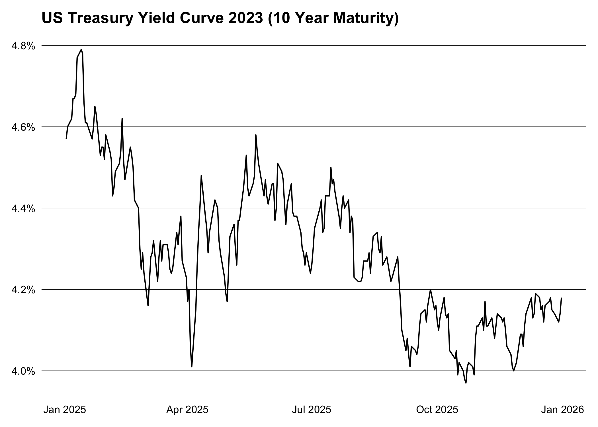

# treasury

## Overview

The goal of treasury is to provide a simple and modern interface to the
[US treasury XML
feed](https://home.treasury.gov/treasury-daily-interest-rate-xml-feed)
for daily interest rates.

## Installation

You can install the released version of **treasury** from
[CRAN](https://CRAN.R-project.org) with:

``` r

install.packages("treasury")
```

And the development version from [GitHub](https://github.com/) with:

``` r

# install.packages("pak")
pak::pak("m-muecke/treasury")
```

## Usage

treasury functions are prefixed with `tr_` and follow the naming
convention of the XML feed.

``` r

library(treasury)

yield_curve <- tr_yield_curve(2025)
head(yield_curve)
#>          date maturity  rate
#>        <Date>   <char> <num>
#> 1: 2025-01-02  1 month  4.45
#> 2: 2025-01-02  2 month  4.36
#> 3: 2025-01-02  3 month  4.36
#> 4: 2025-01-02  4 month  4.31
#> 5: 2025-01-02  6 month  4.25
#> 6: 2025-01-02   1 year  4.17
```



## Related work

- [ustyc](https://github.com/mrbcuda/ustyc) - R package to download and
  parse the US Treasury yield curve data
- [ustfd](https://github.com/groditi/ustfd) - R client for US Treasury
  Fiscal Data API
